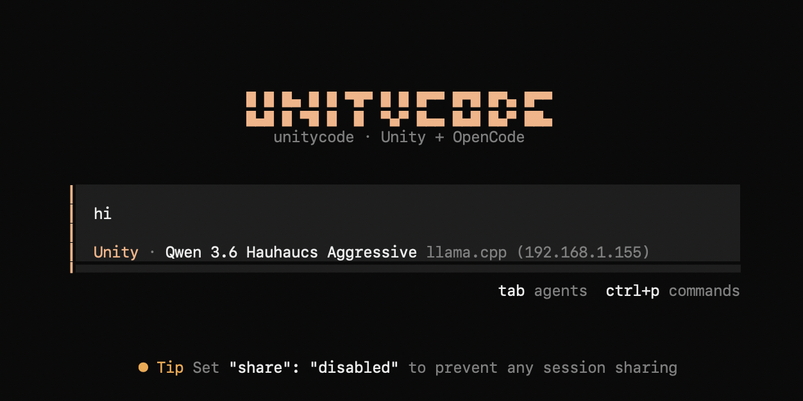

# Unity OpenCode Harness

A portable OpenCode configuration for serious Unity work: MCP-first editor control, safe Unity CLI fallbacks, screenshot-driven visual verification, and production-minded UI Toolkit guidance.



The harness does not copy itself into your Unity project. The launcher points OpenCode at this configuration with `OPENCODE_CONFIG` and `OPENCODE_CONFIG_DIR`, so one installation can serve many projects.

## Safety

UnityCode is designed to make changes inside the Unity project you select. Its bundled policy allows OpenCode file edits and Unity MCP operations, while arbitrary shell commands and access outside the project require confirmation. Use it only with projects you trust and keep your work under version control.

Session sharing is disabled in the bundled configuration. Credentials are loaded only from environment variables or a private key file outside the repository; `.env` and `*.key` files are ignored by Git. Never commit credentials, and review changes before pushing them.

Prompts, selected project context, Unity tool output, and screenshots may be sent to whichever model provider you configure. Use a provider you trust—or a compatible local model—and do not run the harness against sensitive projects without reviewing that provider's data policy.

## Requirements

- `curl`, Git, and Node.js 18 or newer with npm
- OpenCode 1.18.4 or newer
- Unity 6 (older supported editors may work)
- [MCP for Unity](https://github.com/CoplayDev/unity-mcp) installed in the project
- A running MCP for Unity HTTP server (the launcher discovers its project-local PID file)
- An available multimodal, tool-capable model configured in OpenCode. The harness does not pin a model that may later disappear.

## Install

After this repository is public, install or update UnityCode without needing a custom domain:

```bash
curl -fsSL https://raw.githubusercontent.com/Talhasarac/unitycode/main/install.sh | bash
```

The installer clones the repository into `~/.local/share/unitycode`, installs its pinned npm dependencies, and links `unitycode` into `~/.local/bin`. Review [install.sh](install.sh) before piping it to a shell if you prefer to inspect remote scripts first.

To install manually instead:

```bash
git clone https://github.com/Talhasarac/unitycode.git ~/.local/share/unitycode
cd ~/.local/share/unitycode
npm ci --omit=dev --ignore-scripts
mkdir -p ~/.local/bin
ln -sfn "$PWD/bin/UnityCode" ~/.local/bin/unitycode
```

Ensure `~/.local/bin` is on `PATH`, then run `unitycode` while Unity and MCP for Unity are running. UnityCode itself does not require a DeepInfra key.

## Optional DeepInfra setup

No DeepInfra key is required to start UnityCode. To use one of the included DeepInfra models, never put the token in `opencode.jsonc` or a Unity asset. Use either:

```bash
export DEEPINFRA_API_KEY='your-token'
```

or a private key file:

```bash
mkdir -p ~/.config/unity-opencode-harness
chmod 700 ~/.config/unity-opencode-harness
printf '%s' 'your-token' > ~/.config/unity-opencode-harness/deepinfra.key
chmod 600 ~/.config/unity-opencode-harness/deepinfra.key
```

## Launch

After installation, simply type:

```bash
unitycode
```

It detects the Unity project currently open on the machine and launches the branded TUI. You can also provide a project explicitly:

```bash
unitycode /path/to/UnityProject
```

Run a one-shot task:

```bash
unitycode /path/to/UnityProject run \
  "Inspect the current scene, improve the HUD with UI Toolkit, and verify it with screenshots."
```

Useful commands inside OpenCode:

- `/unity-doctor` — inspect editor, package, MCP, render pipeline, scene, and console health
- `/unity-screenshot` — capture and critique the current Game/Scene view
- `/unity-ui` — build or revise a UI Toolkit screen with UXML, USS, C#, and visual checks
- `/unity-verify` — compile, inspect console, run relevant tests, and visually verify
- `/unity-full <task>` — switch to the full-capability agent for generation/import, animation, builds, graphics, packages, physics, ProBuilder, profiling, VFX, or delegated subagents

The default `unity` agent keeps web access but hides the large specialist tool groups above and the `task` subagent tool. Select `unity-full` with the agent picker or use `/unity-full` whenever those capabilities are needed.

For a one-shot full-capability run from the terminal:

```bash
unitycode /path/to/UnityProject --agent unity-full run "Profile and optimize the current scene"
```

## Unity CLI helper

The CLI helper deliberately refuses batch mode while the same project is open in Unity; Unity projects cannot safely be opened twice.

```bash
bin/unity-cli /path/to/UnityProject status
bin/unity-cli /path/to/UnityProject version
bin/unity-cli /path/to/UnityProject tests EditMode
bin/unity-cli /path/to/UnityProject tests PlayMode
bin/unity-cli /path/to/UnityProject compile
bin/unity-cli /path/to/UnityProject execute Company.Product.Editor.Build.PerformBuild
```

While the Editor is open, use MCP `run_tests`, `get_test_job`, `read_console`, and editor resources instead.

## Operating model

1. Read `mcpforunity://instances`, select the right instance if needed, then read editor state and project info.
2. Inspect before mutation. `.unity` scene files are read-only unless the user explicitly requests a scene change; prefer native Unity MCP tools over serialized YAML edits.
3. After script changes, wait for compilation and inspect errors.
4. For UI, test at small and large viewports and check focus, overflow, picking, and dynamic states.
5. Capture a screenshot with `include_image=true`, actually inspect it, fix visible defects, then recapture.
6. Save intended assets. Save a scene only with explicit scene-edit permission, then report the exact verification performed.

## Configuration notes

The installed OpenCode 1.x line uses the top-level `mcp` map represented in `opencode.jsonc`. The Unity endpoint must include `/mcp`, for example `http://127.0.0.1:8080/mcp`. The launcher exports this as `UNITY_MCP_URL`.

By default, UnityCode lets OpenCode select its currently configured default model. To use the tested DeepInfra Qwen model explicitly:

```bash
export UNITY_OPENCODE_MODEL='deepinfra/Qwen/Qwen3.5-397B-A17B'
```

To use another model:

```bash
export UNITY_OPENCODE_MODEL='deepinfra/moonshotai/Kimi-K2.7-Code'
```

If it is still available, you can select the tested free Muse 1.3 model explicitly:

```bash
export UNITY_OPENCODE_MODEL='opencode/muse-spark-1.3-contributor-free'
unitycode /path/to/UnityProject
```

The model must support both tool calling and images if you want screenshot inspection to work. In the included live smoke test, Qwen 3.5 397B correctly grounded the Unity screenshot; Kimi K2.7 Code called Unity tools successfully but misread the same image, so it remains an opt-in coding-oriented alternative.

Muse Spark 1.3 also passed a live prefab workflow after the operating prompt was tightened: it used structured Unity tools, visually verified all objects without clipping, ran the relevant EditMode test, restored the original scene, and deleted its temporary verification scene.

## Branding

`tui.json` loads `plugins/unitycode-logo.tsx`, which replaces OpenCode's home-screen logo through its `home_logo` TUI slot. A live bottom-left indicator shows how many UnityCode terminals are open for the same project and how many are active or waiting for input. Crashed terminals disappear after their presence lease expires. The launcher also sets the terminal-window title to `UnityCode — <project>`.

## Validate the harness

```bash
tests/validate.sh /path/to/UnityProject
```

This checks file layout, shell syntax, resolved OpenCode configuration, and the live MCP handshake without changing the Unity project.
